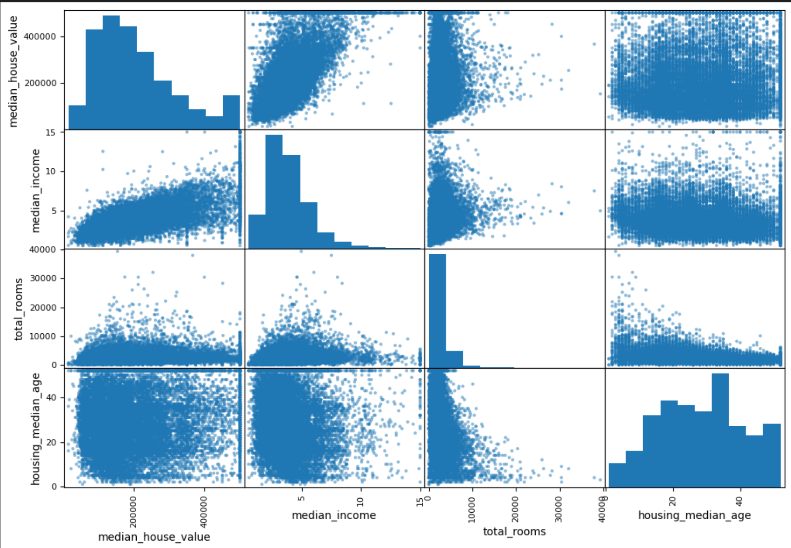
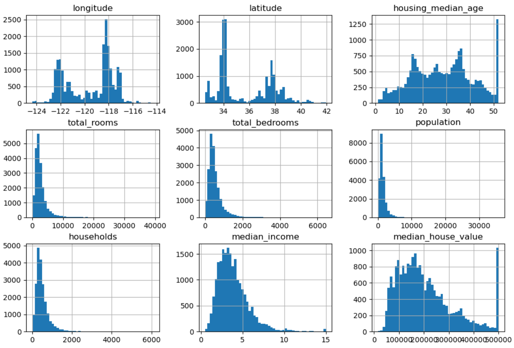
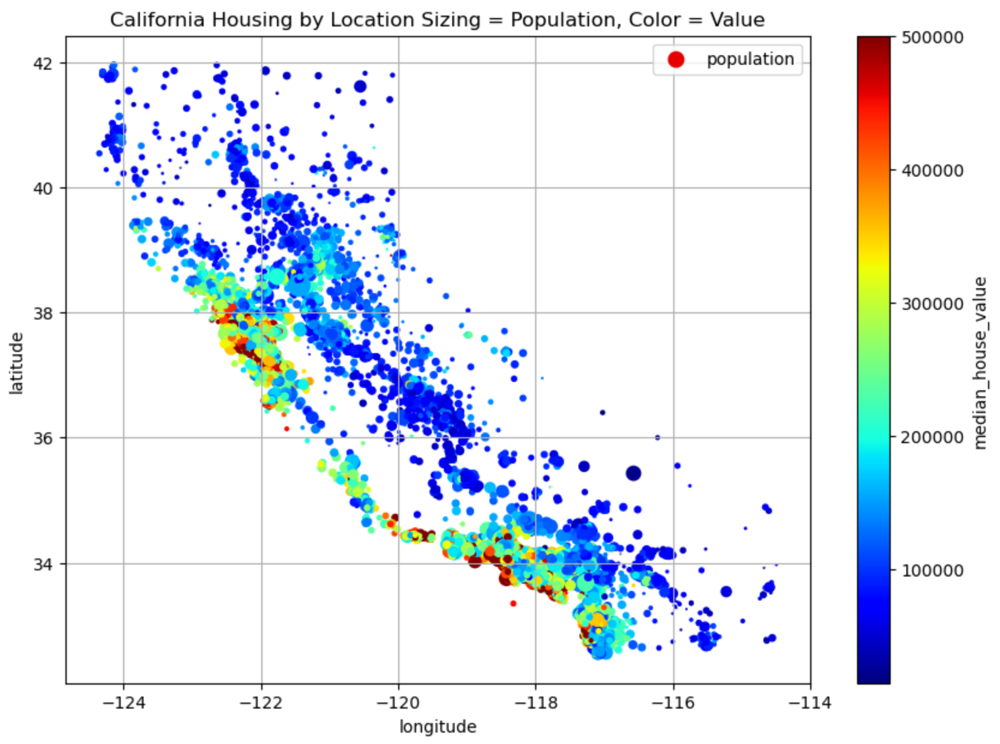
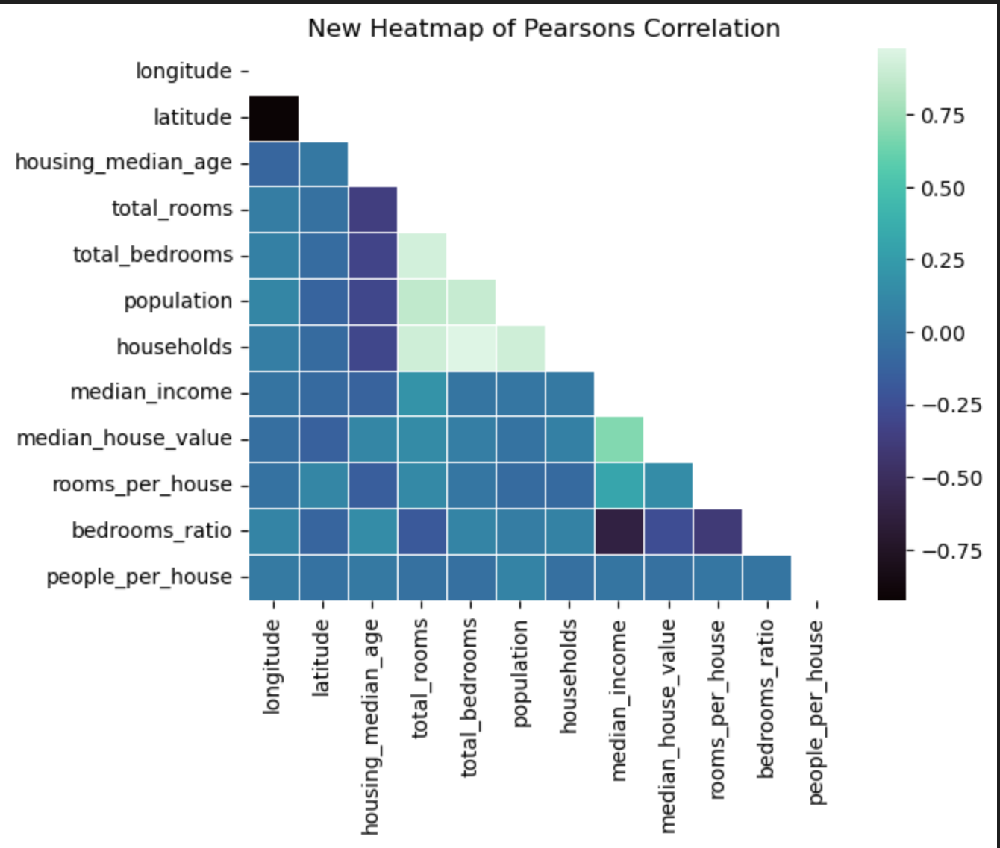
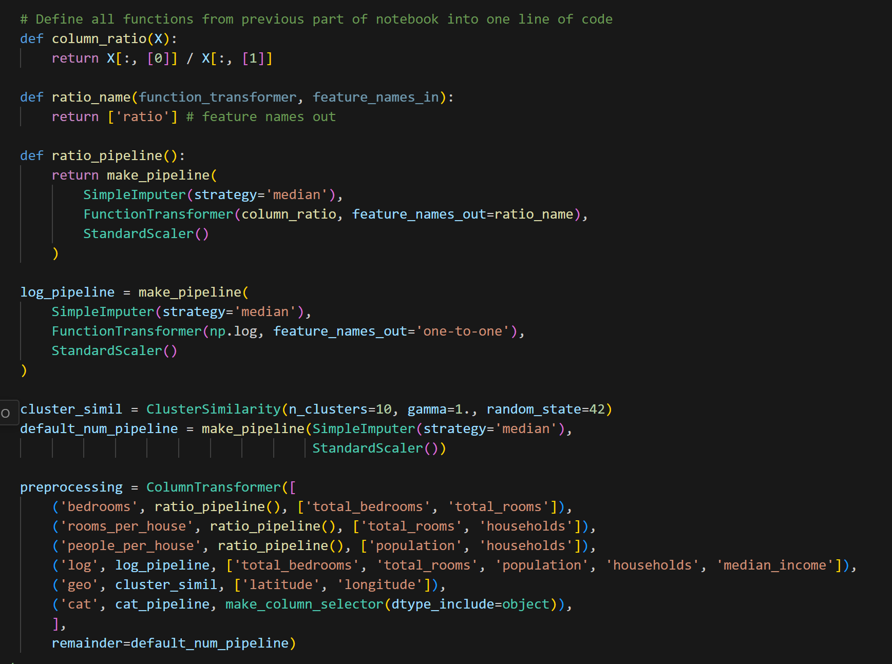
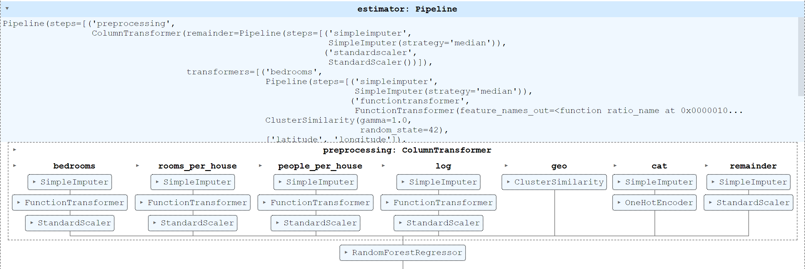
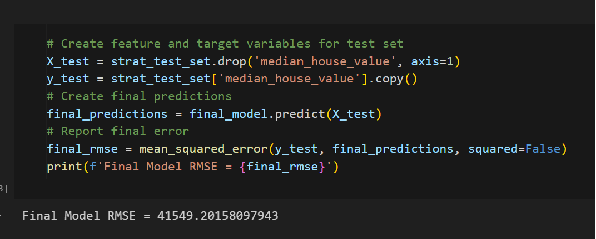

# California Housing Predictor
This Machine Learning project takes data from the StatLib repository on California Housing Prices and aims to create an accurate housing price predictive model. Firstly, Exploratory Data Analysis and feature engineering are performed. Next I develop a robust pipeline for feature handling and model creation. Finally, I perform extensive model selection, cross validation and tuning to extract the most optimal price predictior, saving it for future use.

Additionally I provide a .ipynb cell that loads all necessary functions and packages for using the model later wihtout having to rerun all of the main pipeline.

***

## ML Project Checklist / Overview
1. Frame the problem and look at the big picture
2. Get the data
3. Explore the data to gain insights
4. Prepare the data to better expose the underlying data patterns to machine learning algorithms
5. Explore many different models and shortlist the best ones
6. Fine-tune your models and combine them into a great solution
7. Present your solution
8. Launch, monitor and maintain your system

***

## Technologies

This Jupyter Notebook uses mostly Pandas and Scikit Learn's many incredible modules.

***

## EDA and Feature Engineering

| Pairplot 1 | Pairplot 2 |
|---|---|
|  |  |

| Income Bracket |
| --- |
| |


| Population Plot | Heatmap |
|---|---|
|  |  |


***

## Prepare Pipeline

| Combination of Functions | Pipeline Visual |
|---|---|
|  |  |

***

## Fine tune, Evaluate and Save the Model

```python
# import randomized search cv
from sklearn.model_selection import RandomizedSearchCV
from scipy.stats import randint #to make parameters truly random

# create the parameter distributions
param_distribs = {'preprocessing__geo__n_clusters':randint(low=3, high=50),
                  'random_forest__max_features': randint(low=2, high=20)}
# make random search pipeline
rnd_search = RandomizedSearchCV(
    full_pipeline, param_distributions=param_distribs, n_iter=10, cv=3, 
    scoring='neg_root_mean_squared_error', random_state=42 
)
# fit the model
rnd_search.fit(housing, housing_labels)
```

| Evaluation |
|---|
|   |

### To save your model

```python 
## import model saver
import joblib

## save model 
joblib.dump(final_model, '../models/my_california_housing_model.pkl')
```

### To easily perform feature engineering after your model is loaded into production

```python
# def functions
def column_ratio(X):
    return X[:, [0]] / X[:, [1]]

def ratio_name(function_transformer, feature_names_in):
    return ['ratio'] # feature names out

class ClusterSimilarity(BaseEstimator, TransformerMixin):

    def __init__(self, n_clusters=10, gamma=0.1, random_state = None):
        self.n_clusters = n_clusters
        self.gamma = gamma
        self.random_state = random_state
        
    def fit(self, X, y=None, sample_weight=None):
        self.kmeans_ = KMeans(self.n_clusters, random_state=self.random_state)
        self.kmeans_.fit(X, sample_weight=sample_weight)
        return self
    
    def transform(self, X):
        return rbf_kernel(X, self.kmeans_.cluster_centers_, gamma=self.gamma)
    
    def get_feature_names_out(self, names=None):
        return[f"Cluster {i} similarity" for i in range(self.n_clusters)]
    
log_pipeline = make_pipeline(
    SimpleImputer(strategy='median'),
    FunctionTransformer(np.log, feature_names_out='one-to-one'),
    StandardScaler()
)

cluster_simil = ClusterSimilarity(n_clusters=10, gamma=1., random_state=42)
default_num_pipeline = make_pipeline(SimpleImputer(strategy='median'),
                                     StandardScaler())

preprocessing = ColumnTransformer([
    ('bedrooms', ratio_pipeline(), ['total_bedrooms', 'total_rooms']),
    ('rooms_per_house', ratio_pipeline(), ['total_rooms', 'households']),
    ('people_per_house', ratio_pipeline(), ['population', 'households']),
    ('log', log_pipeline, ['total_bedrooms', 'total_rooms', 'population', 'households', 'median_income']),
    ('geo', cluster_simil, ['latitude', 'longitude']),
    ('cat', cat_pipeline, make_column_selector(dtype_include=object)),
    ],
    remainder=default_num_pipeline)
```
***

